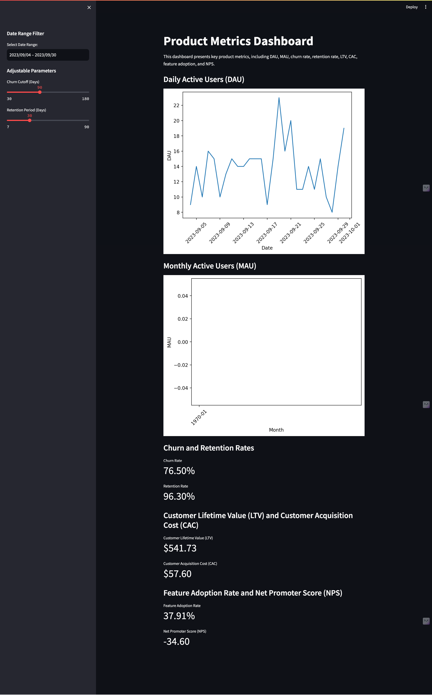

<h1 align="center" id="title">Product Metrics Dashboard</h1>

This is an interactive dashboard built with Streamlit to visualize and analyze key product metrics for SaaS or product-driven businesses. The dashboard provides insights into user engagement, customer retention, and product success.

**Features**

	• Date Range Filters for Daily Active Users (DAU) and Monthly Active Users (MAU) to focus on specific time periods.
	• Interactive Parameters allowing you to adjust churn and retention periods dynamically.
	• Visualization of Key Metrics like Churn Rate, Retention Rate, Customer Lifetime Value (LTV), Customer Acquisition Cost (CAC), Feature Adoption Rate, and Net Promoter Score (NPS).

**Project Structure**

	• product-metrics-dashboard/
	• dashboard_app.py: The main Streamlit app file
	• calculations.py: Optional: A separate file for calculation functions if applicable
	• data/
		• login_data.csv
		• churn_data.csv
		• retention_data.csv
		• purchase_data.csv
		• nps_data.csv
		• feature_usage.csv
	• README.md: Project documentation
	• requirements.txt: Python dependencies for easy setup

**Setup and Running the Dashboard**

Prerequisites

	• Python 3.7 or higher
	• Streamlit and other dependencies (listed in requirements.txt)

Installation

	1. Clone the repository:

git clone https://github.com/shashankborse/product-metrics-dashboard.git
cd product-metrics-dashboard

	2. Install the dependencies:

pip install -r requirements.txt

**Running the Dashboard**

	1. Run the Streamlit app:

streamlit run dashboard_app.py

	2. Open the dashboard: After running the command above, Streamlit will provide a local URL (typically http://localhost:8501) that you can open in your browser to view the dashboard.

**Example Data**

The data/ directory contains example CSV files to simulate product metrics:

	• login_data.csv: Contains login timestamps for calculating DAU and MAU.
	• churn_data.csv: Last active dates for calculating churn.
	• retention_data.csv: First active and return dates for calculating retention.
	• purchase_data.csv: Purchase amounts and subscription dates for LTV.
	• nps_data.csv: NPS scores for customer satisfaction.
	• feature_usage.csv: Usage data for calculating Feature Adoption Rate.

You can replace these with your actual data files as needed.

**Key Metrics Explained**

	• DAU and MAU: Tracks active users daily and monthly.
	• Churn Rate: The percentage of users who stop using the product within a specified period.
	• Retention Rate: Percentage of users retained within a defined timeframe.
	• LTV: The average revenue generated by a user during their time using the product.
	• CAC: The average cost of acquiring a single customer.
	• Feature Adoption Rate: Percentage of active users who use a specific feature.
	• NPS: Measures customer loyalty based on user recommendations.

**License**

This project is licensed under the MIT License. See the LICENSE file for details.

**Dashboard Preview**

Add a screenshot here if available:

**Contributing**

Contributions are welcome! Feel free to open issues for bug reports or feature requests. If you’d like to contribute code, please fork the repository, create a branch, and open a pull request.

**Known Issues and Future Improvements**

	• Known Issues:
 		• No major issues reported.
	• Future Improvements:
		• Add more customizable metrics.
		• Optimize performance for large datasets.
		• Include more interactive visualizations.
